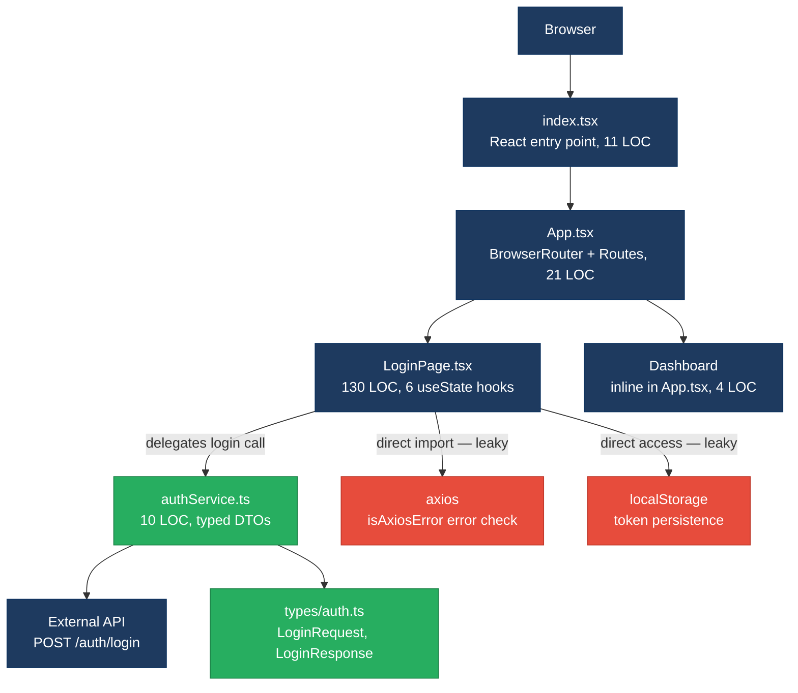
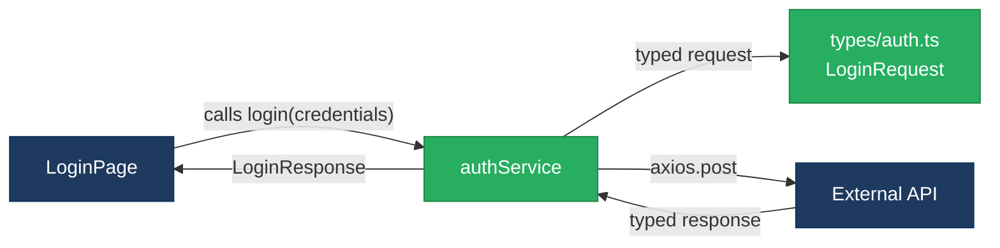
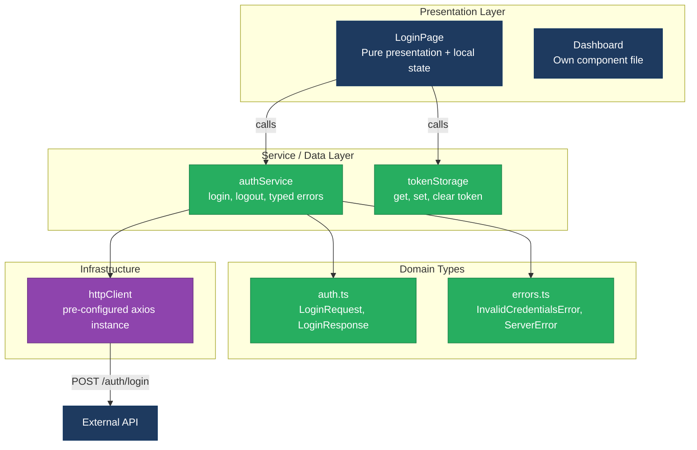
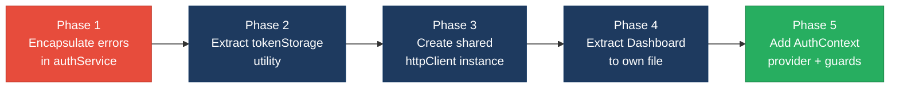

# 1. Architecture & Design Hotspots Analysis

**Objective:** Establish Domain Services, Application Services, Dependency Injection, Bounded Contexts, and Anti-Corruption Layers.

**Date:** 2026-08-13 16:38:53 IST | **Scope:** `shende-shweta/test-repo` (branch `hotfix/MAD-3-aria-invalid-fix`) — React 18 / TypeScript / Tailwind CSS SPA (frontend-only, no backend)

## Executive Summary

> **Executive Summary**
>
> This is a small React 18 / TypeScript single-page application (login form with auth service) comprising 5 non-test source files and 184 total lines of code. The codebase has no backend layer — it is a frontend-only SPA that calls an external API. The architecture is generally clean for its current size: a dedicated `authService` abstracts API calls, typed DTOs exist in `src/types/auth.ts`, and routing is handled via `react-router-dom`. Two moderate issues were identified: (1) the `LoginPage` component imports `axios` directly to use `axios.isAxiosError()` for error classification, creating a leaky abstraction that bypasses the service layer; and (2) `localStorage` access for token persistence is hard-coded inside the component rather than delegated to a service or hook, mixing concerns. No backend controllers, repositories, models, or database access exist in this codebase — backend-oriented hotspots (H1–H3, H6, H8–H9) are not applicable. **Layers covered:** Frontend (React/TypeScript, 5 source files). Backend: none detected.

<div class="metric-grid">
<div class="metric-card"><div class="metric-number">0</div><div class="metric-label">Controllers / Handlers</div></div>
<div class="metric-card"><div class="metric-number">0</div><div class="metric-label">Models / Entities</div></div>
<div class="metric-card"><div class="metric-number">1</div><div class="metric-label">Service Classes Found</div></div>
<div class="metric-card"><div class="metric-number">0</div><div class="metric-label">Repository Classes Found</div></div>
<div class="metric-card"><div class="metric-number">2</div><div class="metric-label">React Page Components</div></div>
<div class="metric-card"><div class="metric-number">5</div><div class="metric-label">Non-Test Source Files</div></div>
</div>

<div class="overall-rating overall-rating--moderate"><div class="overall-rating-label">Overall Codebase Rating — Architecture &amp; Design</div><div class="overall-rating-value">Moderate</div><div class="overall-rating-note">Driven by Moderate-rated F2 (Missing Frontend Service/Data Layer) — LoginPage imports axios directly for error classification, bypassing the authService abstraction.</div></div>

## 1.1 Benchmark Ratings Summary

This is a frontend-only SPA (React 18 / TypeScript). No backend layer exists — there are no controllers, models, repositories, or database access. Backend hotspots H1–H3, H6, H8–H9 are rated by their frontend analogues where applicable, or marked N/A.

| # | Hotspot | Primary KPI | <span class="rating rating-good">Good</span> | <span class="rating rating-moderate">Moderate</span> | <span class="rating rating-high-risk">High Risk</span> | Measured | Rating |
|---|---|---|---|---|---|---|---|
| H1 | Fat Controllers | Avg LOC per controller | <150 | 150–300 | >300 | N/A (no backend controllers) | <span class="rating rating-good">Good</span> |
| H2 | Missing Service Layer | Controllers accessing repos/models | <10 | 10–20 | >20 | N/A (no backend controllers) | <span class="rating rating-good">Good</span> |
| H3 | Missing Repository Pattern | Direct DB access points | <10 | 10–20 | >20 | 0 (no database access) | <span class="rating rating-good">Good</span> |
| H4 | Circular Dependencies | Dependency cycles | 0 | 1–3 | >3 | 0 | <span class="rating rating-good">Good</span> |
| H5 | Shared Utility Abuse | Utility files w/ business logic | 0 | 1–5 | >5 | 0 | <span class="rating rating-good">Good</span> |
| H6 | Direct SQL in Controllers | ORM compliance % | >90% | 60–90% | <60% | N/A (no database) | <span class="rating rating-good">Good</span> |
| H7 | God Classes | Classes >1000 LOC | 0 | 1–3 | >3 | 0 | <span class="rating rating-good">Good</span> |
| H8 | Domain Boundary Violations | Cross-domain access points | 0 | 1–5 | >5 | 0 | <span class="rating rating-good">Good</span> |
| H9 | Shared Database Coupling | Tables shared across domains | <10% | 10–30% | >30% | N/A (no database) | <span class="rating rating-good">Good</span> |
| F1 | Business Logic in Components | Avg LOC per component | <150 | 150–300 | >300 | 130 LOC avg (LoginPage 130, Dashboard ~4) | <span class="rating rating-good">Good</span> |
| F2 | Missing Frontend Service/Data Layer | Components w/ inline API calls | <10 | 10–20 | >20 | 1 component (LoginPage imports axios directly + direct localStorage) | <span class="rating rating-moderate">Moderate</span> |
| F3 | God / Oversized Components | Components >400 LOC | 0 | 1–3 | >3 | 0 | <span class="rating rating-good">Good</span> |
| F4 | Prop Drilling / Global State Abuse | Max prop-drilling depth | ≤2 | 3–4 | >4 | 0 levels (no prop drilling, no global state) | <span class="rating rating-good">Good</span> |
| F5 | Legacy / Inconsistent Component Patterns | Legacy-pattern components | 0 | 1–10 | >10 | 0 (all functional components with hooks) | <span class="rating rating-good">Good</span> |

**No additional hotspots beyond the standard set were observed.**

## 1.2 Hotspot-by-Hotspot Evidence

### F2. Missing Frontend Service/Data Layer <span class="sev sev-medium">Medium</span>

**Benchmark:** `Components with inline API/data-access calls = 1` → falls in the **Moderate** band. While the raw count of 1 is numerically below the 10 threshold, the architectural concern is qualitative: the component bypasses its own service layer by importing `axios` directly and accesses `localStorage` for persistence — a design smell that establishes a bad pattern for future components. Rated Moderate for the leaky abstraction, not the count alone.

**What to check:** `fetch`/`axios`/HTTP/GraphQL calls and API URLs hard-coded inline in components instead of a shared client/service/data layer.

**Evidence:**

**Example 1 — Direct axios import for error classification** (`src/pages/LoginPage.tsx:3,39`):

`LoginPage` imports `axios` directly at line 3, bypassing the `authService` abstraction. While the actual API call is correctly delegated to `authService.login()`, the component then uses `axios.isAxiosError()` at line 39 for error classification — leaking the HTTP client implementation detail into the view layer:

```typescript
// src/pages/LoginPage.tsx:3
import axios from 'axios';

// src/pages/LoginPage.tsx:38-42
    } catch (err) {
      if (axios.isAxiosError(err) && err.response?.status === 401) {
        setError('Invalid email or password.');
      } else {
        setError('Something went wrong. Please try again later.');
      }
```

This qualifies because the component knows about the HTTP client library (`axios`) and HTTP status codes (`401`) — both are infrastructure details that should be encapsulated in the service layer.

**Example 2 — Direct localStorage access for token persistence** (`src/pages/LoginPage.tsx:36`):

Token storage is handled directly inside the component rather than in the auth service or a dedicated token-storage utility:

```typescript
// src/pages/LoginPage.tsx:35-36
      const { token } = await login({ email, password });
      localStorage.setItem('token', token);
```

This qualifies because persistence (where and how the token is stored) is a data-access concern that belongs in the service layer, not the view.

**Why it matters here:** The `authService` already exists as the correct abstraction boundary for authentication concerns. By importing `axios` directly, `LoginPage` is coupled to the HTTP client library — if the team swaps `axios` for `fetch`, `ky`, or another client, `LoginPage` must also change even though it should only consume the service's return type. The `localStorage` coupling means token storage logic cannot be reused (e.g., in a future logout flow, token-refresh interceptor, or auth guard) without duplicating it or reaching back into the component. As the app grows beyond the single login page, this pattern will compound.

**Recommended approach:**
1. Move error classification into `authService` — have `login()` throw typed application errors (e.g., `InvalidCredentialsError`, `ServerError`) instead of raw Axios errors, so the component never touches `axios`.
2. Add a `tokenStorage` utility or extend `authService` with `storeToken(token)` / `getToken()` / `clearToken()` methods to encapsulate `localStorage` access.
3. Remove the `import axios from 'axios'` line from `LoginPage.tsx` entirely — the component should depend only on the service interface.

<!-- affected-files
search: import axios|axios\.isAxiosError|localStorage\.(setItem|getItem|removeItem)
glob: src/**/*.{tsx,ts}
issue: Leaky HTTP client / direct storage access in component
action: Move error classification and token storage into authService
-->

**Not observed (rated Good):** H1, H2, H3, H6, H8, H9 — no backend layer exists (frontend-only SPA); no controllers, repositories, or database access. H4 — import graph is acyclic: `index.tsx → App.tsx → LoginPage.tsx → authService.ts → types/auth.ts`, no cycles. H5 — no utility/helper files with business logic. H7 — no files exceed 1000 LOC (largest is LoginPage at 130 LOC). F1 — components average 130 LOC, well within the 150 LOC target. F3 — no components exceed 400 LOC. F4 — no prop drilling or global state; each component manages its own local state via `useState`. F5 — all components use modern React functional component patterns with hooks; no class components or deprecated APIs.

## 1.3 Diagrams

### Current-state architecture (as-is)



### Clean reference path (target pattern found in codebase)

The `authService.ts` → `types/auth.ts` pattern is already a clean example of a service layer with typed DTOs:



### Domain boundary map

Not observed — this is a single-domain application (authentication only) with no cross-domain data coupling. Skip this diagram.

### Target architecture (proposed)



### Improvement roadmap



## 1.4 Actions Required

| Hotspot | Action | Rating | Priority |
|---|---|---|---|
| F2 — Missing Frontend Service/Data Layer | Move error classification (`axios.isAxiosError` + status code checks) into `authService` as typed application errors; extract `localStorage` token operations into a `tokenStorage` utility or `authService` methods (`storeToken`/`getToken`/`clearToken`); remove direct `axios` import from `LoginPage.tsx` | <span class="rating rating-moderate">Moderate</span> | <span class="sev sev-medium">Medium</span> |

## 1.5 Expected Outcomes

- **Clean abstraction boundary:** LoginPage will depend only on `authService` and `tokenStorage` interfaces, not on `axios` internals — enabling HTTP client swaps without touching view code.
- **Reusable token management:** A `tokenStorage` utility enables consistent token handling across future pages (logout, token refresh, auth guards) without duplicating localStorage logic.
- **Improved testability:** Components can be tested without mocking `axios` or `localStorage` directly — mock the service/utility instead, which is already the pattern used in `authService.test.ts`.
- **Foundation for growth:** As the app grows beyond the login page, the service-layer pattern is already established — new features can follow the same `component → service → typed DTO` architecture without accumulating leaky abstractions.
